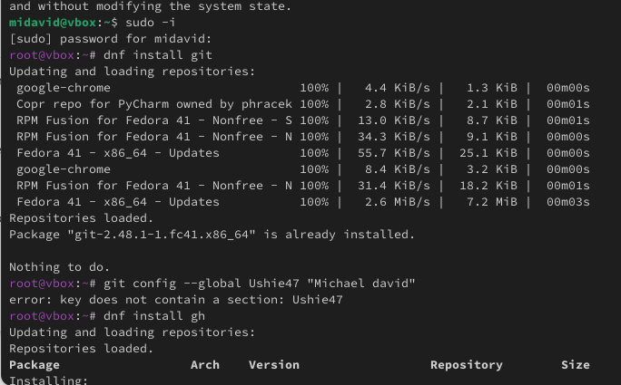
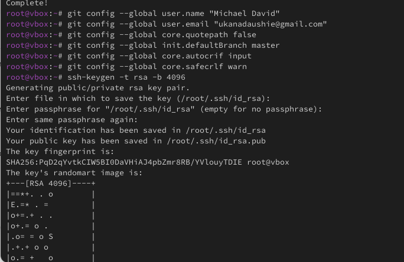
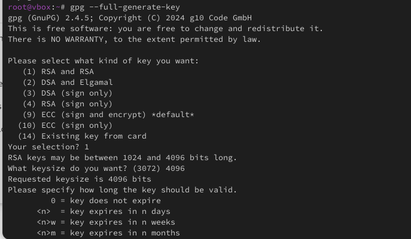
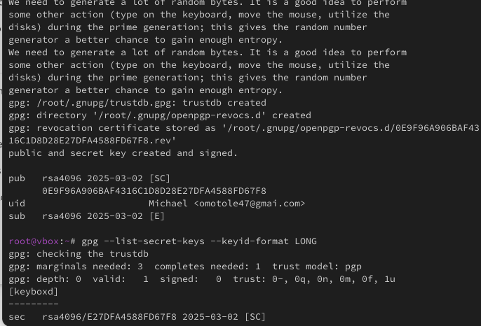
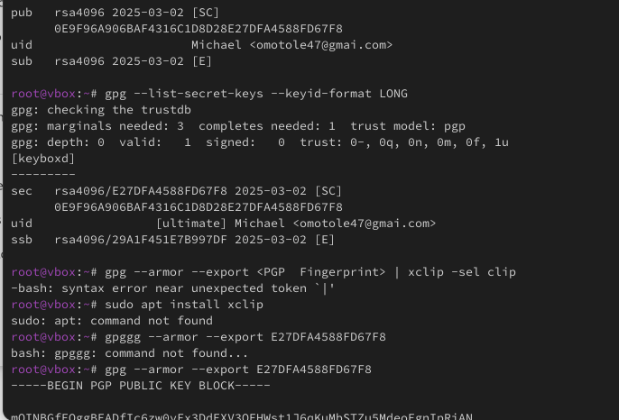
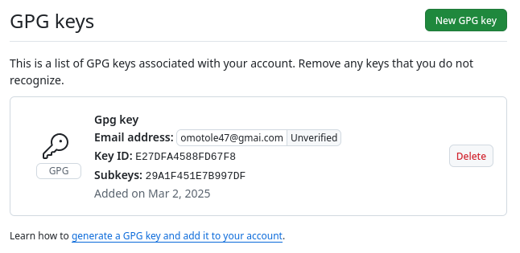
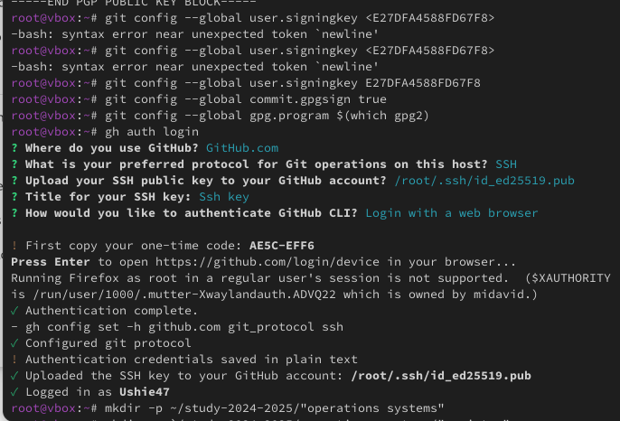

---
## Generic otions
lang: ru-RU
toc-title: "Содержание"

## Bibliography
bibliography: bib/cite.bib
csl: pandoc/csl/gost-r-7-0-5-2008-numeric.csl

## Pdf output format
toc: true # Table of contents
toc-depth: 2
lof: true # List of figures
lot: true # List of tables
fontsize: 12pt
linestretch: 1.5
papersize: a4
documentclass: scrreprt
## I18n polyglossia
polyglossia-lang:
  name: russian
  options:
	- spelling=modern
	- babelshorthands=true
polyglossia-otherlangs:
  name: english
## I18n babel
babel-lang: russian
babel-otherlangs: english
## Fonts
mainfont: PT Serif
romanfont: PT Serif
sansfont: PT Sans
monofont: PT Mono
mainfontoptions: Ligatures=TeX
romanfontoptions: Ligatures=TeX
sansfontoptions: Ligatures=TeX,Scale=MatchLowercase
monofontoptions: Scale=MatchLowercase,Scale=0.9
## Biblatex
biblatex: true
biblio-style: "gost-numeric"
biblatexoptions:
  - parentracker=true
  - backend=biber
  - hyperref=auto
  - language=auto
  - autolang=other*
  - citestyle=gost-numeric
## Pandoc-crossref LaTeX customization
figureTitle: "Рис."
tableTitle: "Таблица"
listingTitle: "Листинг"
lofTitle: "Список иллюстраций"
lotTitle: "Список таблиц"
lolTitle: "Листинги"
## Misc options
indent: true
header-includes:
  - \usepackage{indentfirst}
  - \usepackage{float} # keep figures where there are in the text
  - \floatplacement{figure}{H} # keep figures where there are in the text
---


# **лаборатория 2**

**David Michael Francis**

## цель работы
**Изучить идеологию и применение средств контроля версий.**
**Освоить умения по работе с git.**

### **Описание задачи**
1.*во-первых, я установил git и gh, используя команды dnf install git и dnf install gh*



2.*Я ввел свое имя и адрес электронной почты. Затем я настроил utf-8 в выходных данных git-сообщений. Я настроил проверку и подписание git-коммита.Я также создал ssh-ключ*



3.*Я сгенерировал ключ pgp, используя команду gpg --full-generate-key.*



4.*Я добавил ключ pgp на github*







5.*Настройка подписей автоматической фиксации git*
git config --global user.signingkey <PGP Fingerprint>
git config --global commit.gpgsign true
git config --global gpg.program $(which gpg2)



6.*Настройка каталога курсов*


**Выход:**В этой лабораторной работе мы проверили, как использовать git. Создаем репозитории и клонируем их. Как создать ssh- и pgn-ключи. А также как извлекать и отправлять в github

#### Ответы на контрольные вопросы

1.Что такое системы контроля версий (VCS) и для решения каких задач они предназначаются?
*Системы контроля версий (VCS) отслеживают изменения в файлах, позволяя нескольким людям сотрудничать, вести историю и возвращаться к предыдущим версиям. Они решают такие проблемы, как случайная потеря данных, конфликты кода и отслеживание изменений.*

2.Объясните следующие понятия VCS и их отношения: хранилище, commit, история, рабочая копия.
 
*Хранилище: Центральное место, где хранятся все версии файлов.*
*Фиксация: моментальный снимок изменений, сохраненных в репозитории.*
*История: Запись коммитов, показывающая прошлые изменения.*
*Рабочая копия: локальная версия файлов, изменяемых пользователем.*

3.Что представляют собой и чем отличаются централизованные и децентрализованные VCS? Приведите примеры VCS каждого вида.

*Централизованная система контроля версий (CVCS): Все изменения хранятся в едином центральном репозитории. Пример: Subversion (SVN), Perforce.*
*Децентрализованная система контроля версий (DVCS): У каждого пользователя есть полная копия репозитория, что позволяет работать в автономном режиме. Пример: Git, Mercurial.*

4.Действия VCS при работе с хранилищем в одиночку

*Инициализируйте репозиторий.*
*Вносите изменения и фиксируйте их.*
*Просмотрите историю и при необходимости вернитесь к ней.*

5.Работа с VCS Shared Storage

*Clone/pull the latest version.*
*Make changes and commit them locally.*
*Push changes to the shared repository.*
*Resolve conflicts if necessary.*

6.Основные задачи, решаемые Git

*Отслеживание изменений*
*Совместная работа и слияние*
*Ветвление для параллельной разработки*
*Откат версии*

7.Команды Git и их роли

*Developers: Write and commit code.*
*Maintainers: Review and merge changes.*
*Release Managers: Manage versions and releases.*

8.Использование локальных и удаленных репозиториев
- Локальный репозиторий:

```
git init  
git add .  
git commit -m "Initial commit"
```
- Удаленный репозиторий:

```
git remote add origin <repo_url>  
git push origin main  
git pull origin main  
```

9.Ветви и их назначение: Ветки позволяют вести параллельную разработку, не затрагивая основную кодовую базу.

```
git branch feature-branch  
git checkout feature-branch  
```

10.Игнорирование файлов в Git

```
node_modules/  
*.log
```
This prevents unnecessary files from being committed.
  


