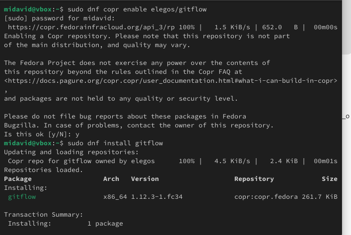
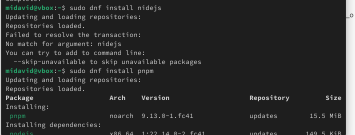
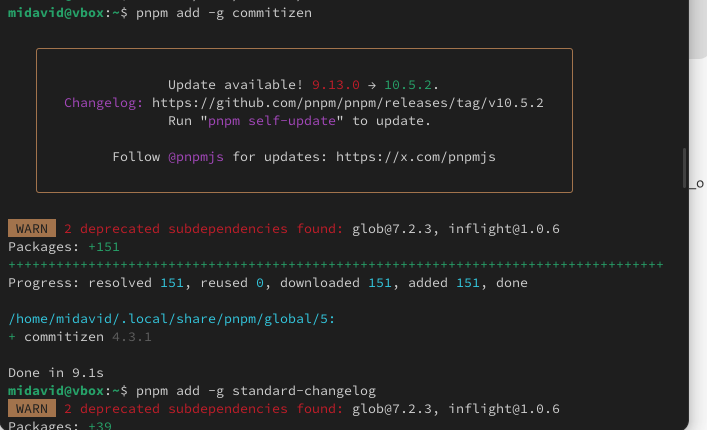
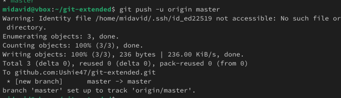
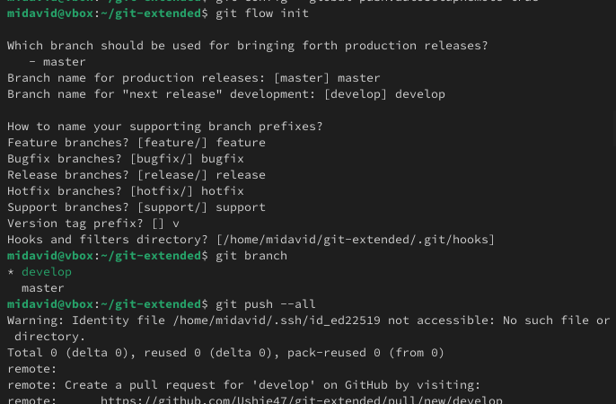

# **лаборатория 4**

**David Michael Francis**
**10322249023**

## цель работы
Получение навыков правильной работы с репозиториями git.

### **Описание задачи**

Я установил git flow из галереи хранилища copr



Установка Node.js Программное обеспечение для семантического версионирования и 
общих коммитов основано на Node.js



Настройка Node.js:Для работы с Node.js добавьте директорию с исполняемыми файлами,
установленную в .yarnPATH


commitizen:Эта программа используется для форматирования коммитов. pnpm add -g commitizen
standard-changelog: Эта программа используется для помощи в создании logs.pnpm add -g standard-changelog



#### *Практический сценарий использования git*

1. Подключение репозитория к github
Создайте репозиторий на GitHub. Например, назовем его .git-extended. Сделайте первый коммит и загрузите его на github



2. Общая конфигурация коммитов
Конфигурация для Node.Мы будем использовать инициализацию PNPM


3. Конфигурация git-flow

Инициализируем git-flow
```
git flow init
```
Префикс для ярлыков установим в .v

Проверьте, что Вы на ветке :develop
```
git branch
```
Загрузите весь репозиторий в хранилище:
```
git push --all
```
Установите внешнюю ветку как вышестоящую для этой ветки:
```
git branch --set-upstream-to=origin/develop develop
```
Создадим релиз с версией 1.0.0
```
git flow release start 1.0.0
```
Создадим журнал изменений
```
standard-changelog --first-release
```
Добавим журнал изменений в индекс
```
git add CHANGELOG.md
git commit -am 'chore(site): add changelog'
```
Зальём релизную ветку в основную ветку
```
git flow release finish 1.0.0
```
Отправим данные на github
```
git push --all
git push --tags
```
Создадим релиз на github. Для этого будем использовать утилиты работы с github:
```
gh release create v1.0.0 -F CHANGELOG.md
```



##### **Работа с репозиторием git**

1. Разработка новой функциональности
Создадим ветку для новой функциональности:
```
git flow feature start feature_branch
```
Далее, продолжаем работу c git как обычно.
По окончании разработки новой функциональности следующим шагом следует объединить ветку c :feature_branchdevelop
```
git flow feature finish feature_branch
```
2. Создание релиза git-flow
Создадим релиз с версией :1.2.3
```
git flow release start 1.2.3
```
Обновите номер версии в файле . Установите её в .package.json1.2.3
Создадим журнал изменений
```
standard-changelog
```
Добавим журнал изменений в индекс
```
git add CHANGELOG.md
git commit -am 'chore(site): update changelog'
```
Зальём релизную ветку в основную ветку
```
git flow release finish 1.2.3
```
Отправим данные на github
```
git push --all
git push --tags
```
Создадим релиз на github с комментарием из журнала изменений:
```
gh release create v1.2.3 -F CHANGELOG.md
```

**Выход:**В этой лабораторной работе я изучал, как выполнить работу для тестового
репозитория и конвертировать рабочий репозиторий в репозиторий с git-flow и
обычными коммитами.
