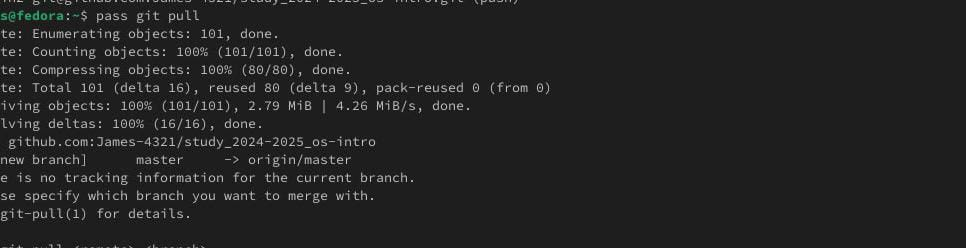

#  **Лаборатору Отчет No5**

**ДЭВИД МАЙКЛ ФРАНСИС**

## Цель работы
**Цель данной лабораторной работы — научиться пользоваться менеджером паролей и Chezmoi**

### **Описание задачи**
1. **сначала я установил gopass и pass с помощью команды**
```
dnf install pass pass-otp
dnf install gopass
```


2. **Я просмотрел список имеющихся у меня ключей gpg с помощью команды**
```
gpg --list-secret-keys
```


3. **Я инициализировал хранилище и синхронизировался с git, а также установил адрес размещенного хранилища с помощью команд**
```
pass init omotole47@gmail.com
pass git init
pass git remote add origin git@github.com:Ushie47/study_2024-2025_os-intro.git
```


**Для синхронизации выполняется следующая команда:**
```
pass git pull
pass git push
```


4. **Если изменения вносятся непосредственно в файловую систему, вам необходимо вручную зафиксировать и загрузить изменения:**
```
cd ~/.password-store/
git add .
git commit -am 'edit manually'
git push
```


# Настройка интерфейса с помощью браузера
**Сначала мне нужно скачать плагин BrowserPass в браузере, затем скачать интерфейс для взаимодействия с браузером в терминале с помощью команды**
```
dnf copr enable maximbaz/browserpass
dnf install browserpass
```


## Сохранение пароля
**Нам нужно создать пароль, а затем отобразить пароль для конкретного файла в терминале с помощью команды**
```
pass insert [study]/[github]
pass [study]/[github]
```


### Управление конфигурационными файлами
**Я установил дополнительное программное обеспечение**


**Установка бинарного файла. Скрипт определяет архитектуру процессора и операционную систему и загружает необходимый файл с помощью wget**
```
sh -c "$(wget -qO- chezmoi.io/get)"
```
**Я создал свой собственный репозиторий для конфигурационных файлов на основе шаблона:**
```
gh repo create dotfiles --template="yamadharma/dotfiles-template" --private
```
**Я инициализировал его с помощью своего github**
```
chezmoi init git@github.com:Ushie47/dotfiles.git
```


**Извлекать изменения из репозитория и применять их с помощью одной команды**
```
chezmoi update
```
**Чтобы извлечь последние изменения из репозитория и увидеть, какие изменения не применяются фактически**
```
chezmoi git pull -- --autostash --rebase && chezmoi diff
```
**Чтобы применить изменения, мы используем команду**
```
chezmoi apply
```
**Вы можете автоматически фиксировать и отправлять изменения в исходный каталог в репозитории.По умолчанию эта функция отключена.Чтобы включить его, добавьте в файл конфигурации следующее:~/.config/chezmoi/chezmoi.toml**
 ```
[git]
    autoCommit = true
    autoPush = true
```


**Вывод: из этой лабораторной работы я узнал, как использовать chezmoi для создания файла конфигурации и как использовать менеджер паролей**


